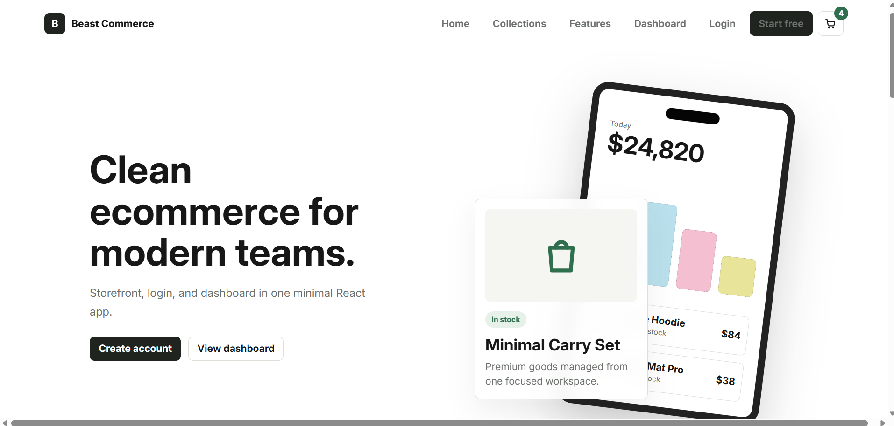
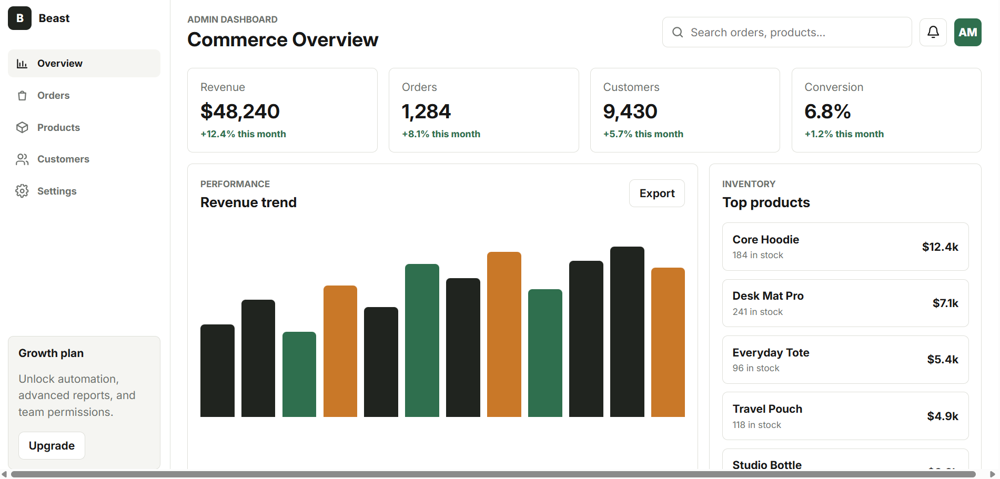
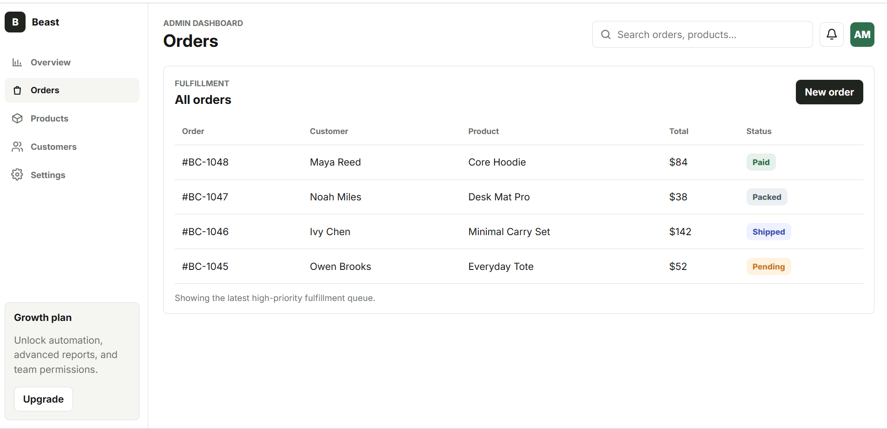
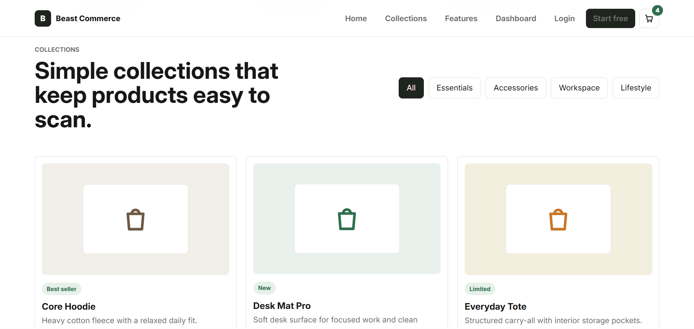

# Beast Commerce

A clean React ecommerce starter with a landing page, login/signup screens, product detail pages, cart route, and a modern admin dashboard.

Live preview: https://react-js-starter-mu.vercel.app/

## Preview









## Features

- Minimal ecommerce landing page
- Product cards with filters, pricing, reviews, and add-to-cart actions
- Product detail page with thumbnail gallery
- Login and signup pages
- Admin dashboard with overview, orders, products, customers, and settings
- Colored order statuses
- Customer table actions
- CSS variables for easy theme editing
- Responsive layout

## Routes

- `/` - Landing page
- `/login` - Login
- `/signup` - Signup
- `/cart` - Cart
- `/product/core-hoodie` - Product detail
- `/admin` - Dashboard overview
- `/admin/orders` - Orders
- `/admin/products` - Products
- `/admin/customers` - Customers
- `/admin/settings` - Settings

## Getting Started

Install dependencies:

```bash
npm install
```

Run the development server:

```bash
npm run dev
```

Build for production:

```bash
npm run build
```

## Project Structure

```text
src/
  App.js
  data/
    products.js
  pages/
    Landing.jsx
    Login.jsx
    Signup.jsx
    AdminDashboard.jsx
  components/
    ProductDetail.jsx
    Cart.jsx
  styles/
    global.css
  ui/
    AuthLayout.jsx
    Icons.jsx
```

## Theme

Main colors, surfaces, radius, shadows, and typography are controlled in `src/styles/global.css` under `:root`.
